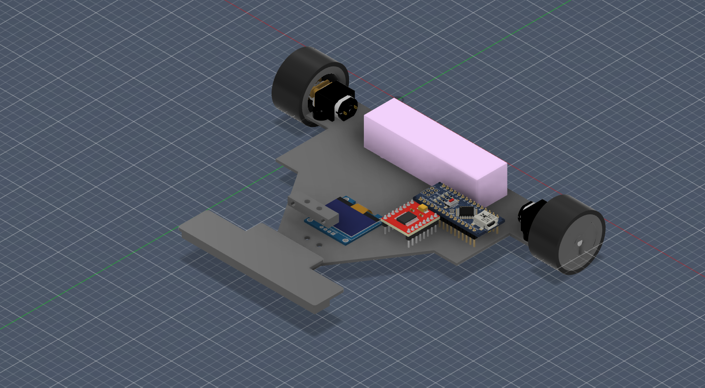
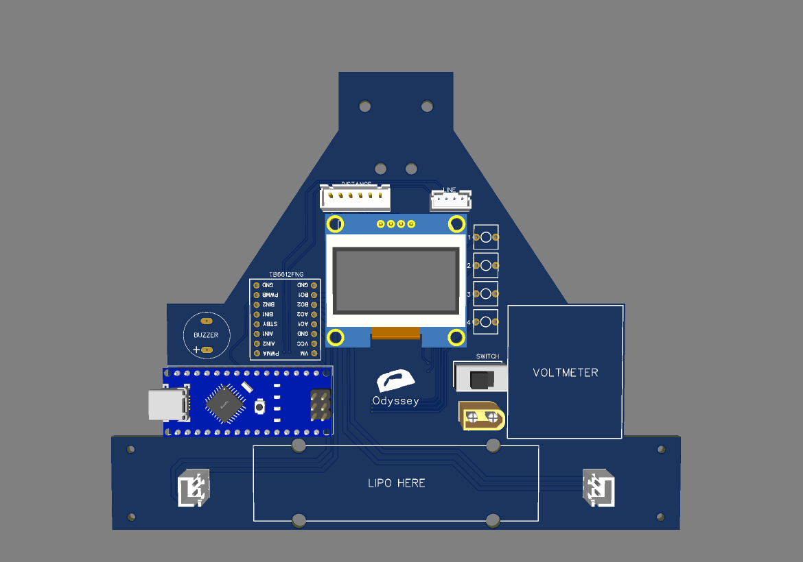
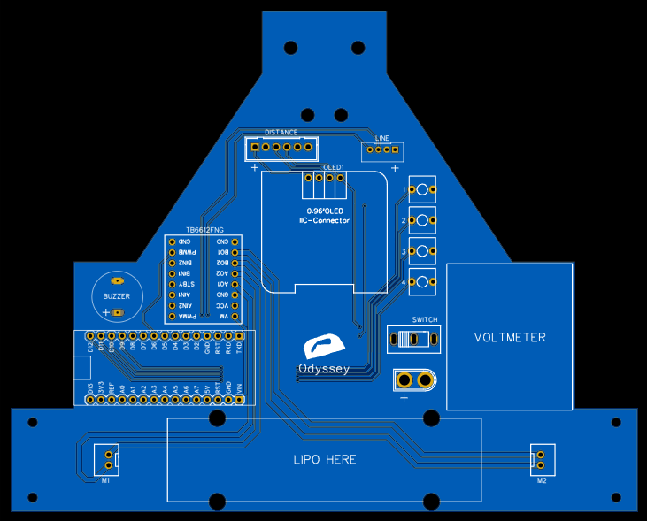
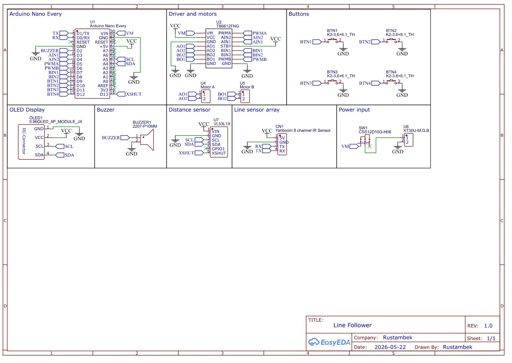

# Line follower v2

## About

As the name suggests, its the second version with custom pcb and better hardware. I use PCB as a chasis and mount all components on it. For wheels, I designed mold in CAD to make silicone tires. Tire diameter is less than wheel diameter, so it sticks better and lowers the chance of slipping off

## Features

- Detect and avoid obstacles
- PID control
- OLED Display to show values
- Buttons to tune PID values
- Buzzer to signal start
- Low voltage alarm

## How to open PCB files
- Go to EasyEDA Std
- Go to File > Open > EasyEDA
- Select easyeda.zip file in PCB folder
- Click Import

## Images

### CAD View

**Note:** I couldn't find CAD models of some components, so I matched mount holes instead. All dimensions are correct
### 3D View

### 2D View

## Schematic

## Gerbers
Gerbers file is in Fabrication folder, I chose black as a PCB color

## 3D Print (jlc3dp.com)

|File                     |Quantity|Material       |
|-------------------------|--------|---------------|
|box.stl                  |1       |JLC Black Resin|
|lid.stl                  |1       |JLC Black Resin|
|small_wheel.stl          |2       |JLC Black Resin|
|wheel.stl                |2       |PA12-HP Nylon  |
|motor_mount.stl          |2       |PA12-HP Nylon  |
|distance_sensor_mount.stl|1       |PA12-HP Nylon  |

## BOM

|Name                                   |Quantity|Total Cost (USD)|Link                     |
|---------------------------------------|--------|----------------|-------------------------|
|N20 motor 12V 500RPM                   |2       |4.2             |https://ali.click/gukjd1s|
|IMAX B6 Balance charger                |1       |28.48           |https://ali.click/nadmd1u|
|VL53L1X                                |1       |3.04            |https://ali.click/zucjd1w|
|JST PH2.0 4P connector                 |1       |0.78            |https://ali.click/thyid1k|
|JST XH2.54 6P wire + connector         |1       |1.06            |https://ali.click/dawid1q|
|JST XH2.54 2P wire + connector         |2       |0.54            |https://ali.click/jwvid1j|
|M2 screw                               |4       |1.76            |https://ali.click/vkvid1w|
|M2 nut                                 |4       |0.48            |https://ali.click/bfvid1k|
|Releasable zip ties                    |1       |1.81            |https://ali.click/wctid1n|
|XT30U-M Connector                      |1       |0.88            |https://ali.click/g5tid1h|
|Switch                                 |1       |0.98            |https://ali.click/rosid1l|
|Lipo 3s 72mm x 18mm                    |2       |20              |https://ali.click/qedmd18|
|Female pin header 1x15                 |2       |1.26            |https://ali.click/tmyfd1y|
|Short male pin header 1x4              |1       |0.87            |https://ali.click/xeyfd1s|
|OLED Display 128x64 4P                 |1       |1.59            |https://ali.click/hayfd1t|
|TMB12A05                               |1       |2               |https://ali.click/k2yfd11|
|Female pin header 1x8                  |2       |0.73            |https://ali.click/qnxfd1k|
|2 pin button                           |4       |1               |https://ali.click/rzwfd1p|
|Lipo Voltmeter                         |1       |1.2             |https://ali.click/grcjd17|
|Arduino Nano Every                     |1       |16.2            |https://ali.click/9npcd1e|
|Yahboom 8 channel IR sensor (Full pack)|1       |11.95           |https://ali.click/u2svc1b|
|TB6612FNG                              |1       |0.86            |https://ali.click/hkdmd1x|
|M3 nut                                 |2       |0.87            |https://ali.click/kqdmd1u|
|M4 screw length>=35mm                  |6       |1.68            |https://ali.click/0memd11|
|M4 nut                                 |6       |0.73            |https://ali.click/rgemd1v|
